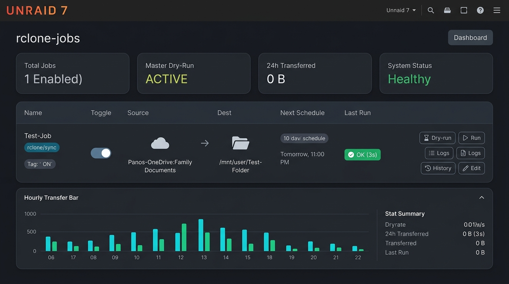

# rclone-jobs — UI & UX Enhancement Proposal

This document outlines proposed UI and UX enhancements for the **rclone-jobs** Unraid 7 plugin. The goal is to elevate the interface from a dense technical utility into a polished, modern, native Unraid 7 dashboard while keeping 100% of the underlying architecture, safety guarantees, zero-dependency footprint, and engine contracts intact.

---

## Redesign Concept Mockup

---

## 1. Top Dashboard Strip & Quick-Glance Metric Cards

### Current State
A single plain-text row sits above the jobs table:
`MASTER DRY-RUN ON` (pill) `1 jobs · 1 enabled` `• live: connecting...`

### Enhancement
Replace the plain text strip with 4 compact KPI / metric cards integrated into Unraid's dark palette:
- **Total / Active Jobs:** e.g., `1 Enabled` with active/disabled counts.
- **Master Dry-Run Safety Status:** Clear visual pill showing `ACTIVE` (amber warning) or `LIVE` (emerald green).
- **24h Throughput & Runs:** Summarizes data moved (e.g. `0 B` or `1.4 GB`) and total run count in the last 24 hours.
- **Engine / Daemon Health:** Live SSE connection indicator (`Healthy` with a pulsing green dot, degrading gracefully to polling indicator if SSE drops).

### Benefits
- Immediate situational awareness upon loading the page.
- Clear visual warning if the master safety dry-run switch is active before triggering jobs.

---

## 2. Action Button Ergonomics & Grouping

### Current State
6 orange-bordered flat buttons (`DRY`, `RUN`, `LOG`, `HIST`, `EDIT`, `DEL`) are crammed side-by-side inside each table row.

### Enhancement
- **Icon + Label Design:** Leverage Unraid's built-in FontAwesome icon set:
  - `Dry-run`: `<i class="fa fa-flask"></i> Dry`
  - `Run`: `<i class="fa fa-play"></i> Run` (or `<i class="fa fa-stop"></i> Stop` when running)
  - `Logs`: `<i class="fa fa-file-text-o"></i> Log`
  - `History`: `<i class="fa fa-history"></i> Hist`
  - `Edit`: `<i class="fa fa-pencil"></i> Edit`
  - `Delete`: `<i class="fa fa-trash"></i>` (subtle muted icon with confirmation guard)
- **Visual Grouping:** Visually group primary execution triggers (`Run` / `Dry`) separately from diagnostics (`Log`, `History`) and job management (`Edit`, `Delete`).
- **Running State Animation:** During live runs, highlight the active row with a subtle pulsing border and replace `Run` with a distinct red `Stop` button.

---

## 3. Visual "Source → Destination" Flow

### Current State
Plain monospace text truncated in a table cell:
`Panos-OneDrive:Family Documents → /mnt/user/Test-Folder`

### Enhancement
- **Remote vs. Local Badges:**
  - Cloud / Remote paths: Display a `<i class="fa fa-cloud"></i>` icon with remote name highlighted.
  - Local array/share paths: Display a `<i class="fa fa-folder"></i>` or `<i class="fa fa-hdd-o"></i>` icon.
- **Flow Connector:** Directional connector icon `→` with distinct hover tooltip showing the full un-truncated source and destination.

---

## 4. Human-Readable Status & Dry-Run Breakdown

### Current State
Cryptic terminal-style output strings:
- Last run: `0 (3s)` with tiny subtext `last OK: 2026-09-08 17:21:04`
- Last dry-run: `09-08 15:22 +0 -0 !0`

### Enhancement
- **Semantic Status Badges:**
  - Green success pill: `<i class="fa fa-check-circle"></i> OK (3s)`
  - Amber warning pill: `<i class="fa fa-exclamation-triangle"></i> Warn (rc=24)`
  - Red failure pill: `<i class="fa fa-times-circle"></i> Failed (rc=1)`
- **Dry-Run Diff Chips:** Break down simulated changes into structured mini-chips:
  - `+0` (green for copied/added files)
  - `-0` (amber for deleted files)
  - `!0` (red for failed files)
- **Acknowledgement Banner:** If deletions exceed threshold, render a glowing amber `Needs Ack` badge with direct one-click ack modal.

---

## 5. Modernized Run History & Sparkline Drawer

### Current State
Clicking `HIST` injects raw text lines, standard HTML tables, and basic CSS block elements directly into the page below the jobs table.

### Enhancement
- **Collapsible Drawer / Sub-Card:** History expands smoothly within or directly below the targeted job row.
- **Modern 48h Hourly Sparkline:**
  - Smooth rounded CSS bar chart with cyan/emerald bars for transferred volume or busy seconds.
  - Red indicator bars for hours with failures.
  - Interactive tooltips showing exact time, run count, transferred bytes, and error counts.
- **Filter Toggle:** Quick pill buttons for `All runs` vs `Failures only`.
- **Daily Rollup Table:** Clean table styling utilizing Unraid's native CSS variables (`--background`, `--border`, `--text`).

---

## 6. Form Discovery & "Add Job" Placement

### Current State
An accordion at the bottom of the page (`v ^ Add job`) that is easy to overlook when multiple jobs are listed.

### Enhancement
- **Header Action Button:** Add a primary `+ Add Job` button at the top right of the Jobs table header (matching standard Unraid patterns like `+ Add Container`).
- **Smooth Expansion:** Clicking smoothly opens and scrolls to the form.
- **Card-Based Form Sections:** Visual card containers for:
  1. *Basics* (Name, Description, Enabled state)
  2. *Schedule* (Frequency selector, visual cron helper)
  3. *Transfer Settings* (Engine, Mode, Source/Destination with browser modals)
  4. *Limits & Safety* (Bandwidth limit, Max deletes, Dry-run gate, Quiet window)

---

## 7. Technical Feasibility & Constraints

All suggested enhancements adhere strictly to the project rules:
1. **Zero External Dependencies:** Built purely with HTML, Vanilla CSS, and Unraid's pre-packaged jQuery and FontAwesome libraries.
2. **Offline-Lint Compliant:** No build script changes or extra package managers needed.
3. **Engine Invariants Untouched:** Backend `rclone-jobs.sh`, cron scheduling, lock mechanics, and exit codes remain untouched.
4. **Theme Adaptation:** Uses Unraid CSS variables (`--background`, `--border`, `--text`, `--gray-text`) so the interface renders cleanly in both dark and light modes.
